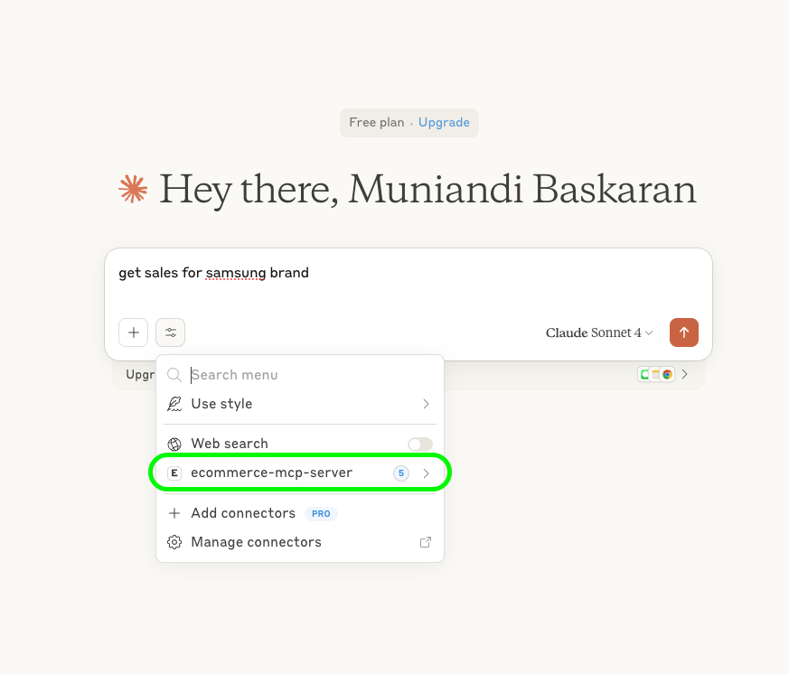
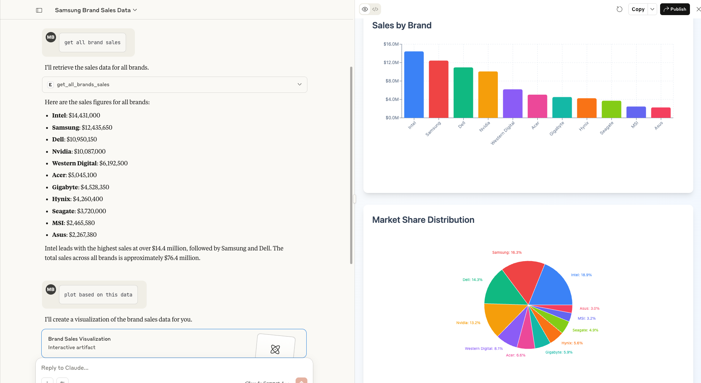
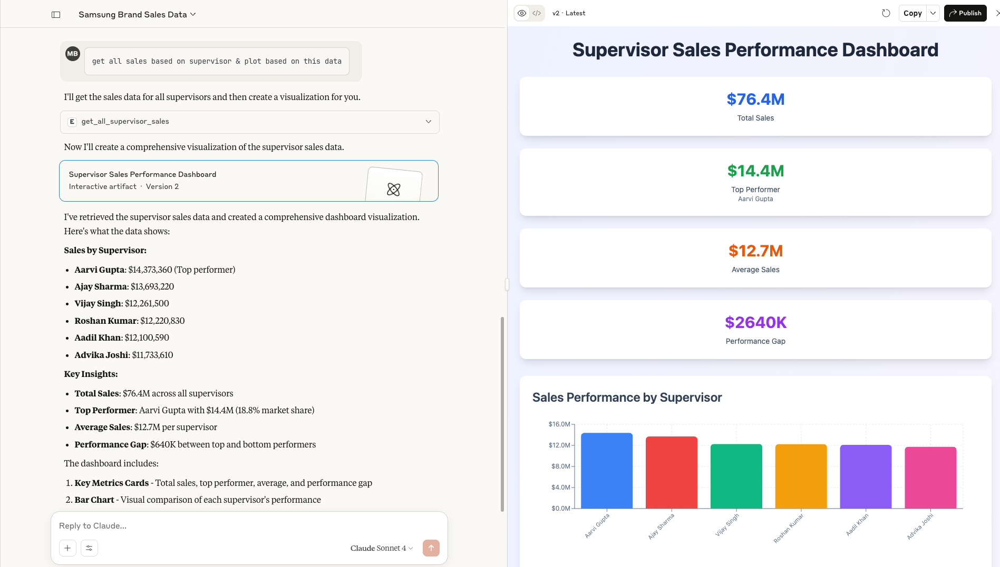

# mcp-ecommerce-server-data
Ecommerce Data files exploration for implementing Model Context Protocol (MCP) servers.


# Steps to Create MCP Server

Git Clone 
https://github.com/muniandibaskaran/mcp-server-data.git

```
run below commands
cd ecommerce-mcp-server
pip install -r requirements.txt
python mcp_data_ecommerce_server.py
```
# Steps to createe Gemini Client to interact with e-commerce data

```
Replace <api-key> with your gemini Api key
run below commands 
python mcp_gemini_client.py
```

# Steps to Add MCP server in Claude Desktop
```
Go to Claude -> settings -> Developer -> Edit Config -> Open claude_desktop_config.json
```

Update server python script full path in this claude_desktop_config.json and restart Claude
Sample config
```
{
  "mcpServers": {
    "ecommerce-mcp-server": {
      "command": "python3",
      "args": ["mcp-server-data/ecommerce-mcp-server/mcp_data_ecommerce_server.py"]
    }
  }
}
```
### MCP server visible in settings and we can see 5 tool chain are added


## Sample prompts & Results


### get all brand sales & plot based on this data


### get all sales based on supervisor & plot based on this data



# References
Ecommerce Sample Data
https://www.kaggle.com/datasets/ayushparwal2026/online-ecommerce?resource=download

FastMCP
https://gofastmcp.com/getting-started/welcome
